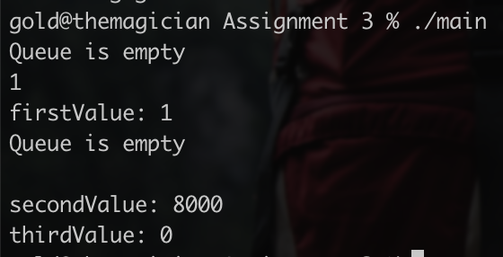

# Assignment 3: Linked Queue

The `main()` function contains the testing functions and comments describing the expected output.

There is no interactivity without changing the source code and recompiling.

