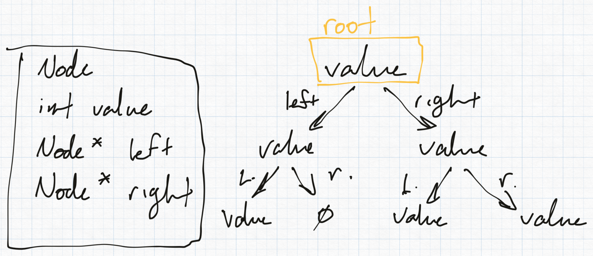
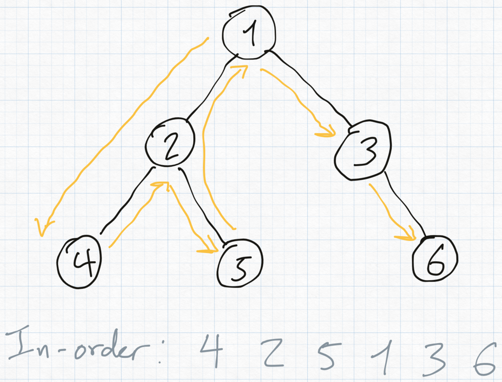
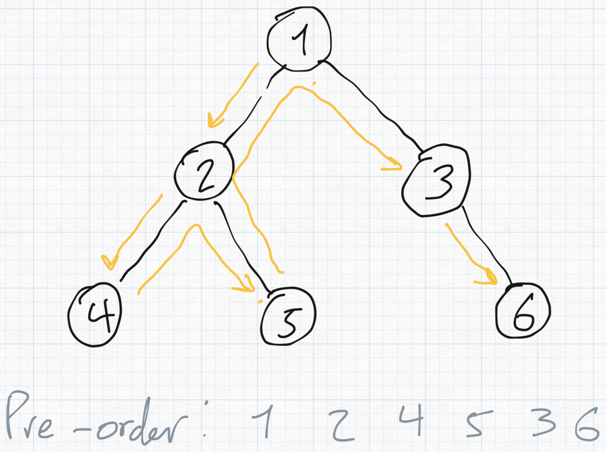
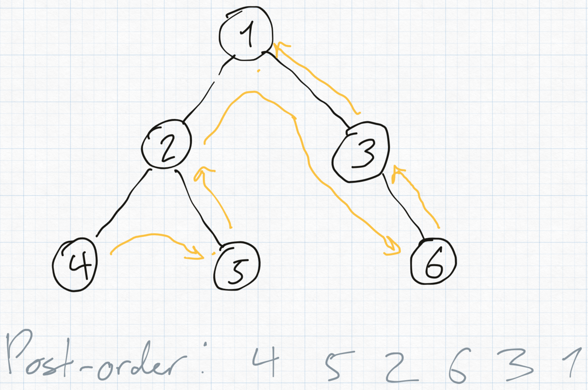

# CS 260 Assignment 6

## Binary Search Tree

The structure of a binary search tree is as follows:

- The `Node`s need to hold a value (in this case, an integer), and pointers to child `Node`s, keeping track of which is to the "left" and the "right".
- The `BinaryTree` class holds a pointer to a `Node` as the root of the tree, has an `insert` function to add a new `Node` while keeping the tree sorted, a `search` function to find if the tree contains a given value, and a `remove` function to destroy one of the values in the tree, as well as a utility `print` function so we can see the values held within.

> [!NOTE]
> The `remove` function is tricky because we have to maintain the binary search tree's property of having all the values in the correct order. There are a few cases we have to cover for:
> - If the node is a leaf node with no children, just remove it.
> - If the node has *exactly one* child, replace the deleting node with its child.
> - If the node has *two* children, replace the node with its in-order successor node, then delete the successor node so it's not duplicated.

Traversal of the tree is also important to consider:

- "In-order" traversal goes from left to right spatially along the tree
    - Visits Left -> Root -> Right
    - Complexity O(n)

- "Pre-order" traversal goes from the root down, biasing towards the left child when possible
    - Visits Root -> Left -> Right
    - Complexity O(n)

- "Post-order" traversal goes from the bottom-most children on the left side to the right, then up
    - Visits Left -> Right -> Root
    - Complexity O(n)

